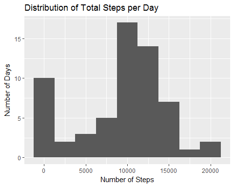
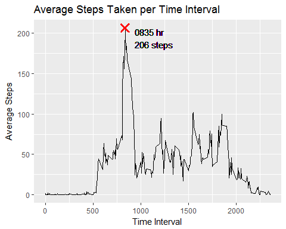
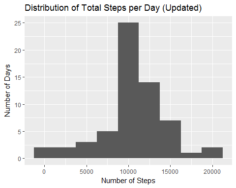
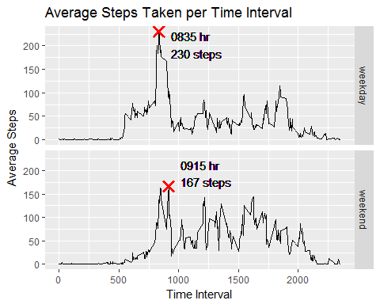

## Loading and preprocessing the data

```r
raw_data <- readr::read_csv("activity.zip")
dim(raw_data)
```

```
## [1] 17568     3
```


## What is mean total number of steps taken per day?

```r
library(dplyr)
library(ggplot2)

# Visualise data using histogram
sum_data <- raw_data %>% 
  group_by(date) %>%
  summarise(total = sum(steps, na.rm = TRUE))

sum_data %>% 
  ggplot(aes(x = total)) +
  geom_histogram(binwidth = 2500) + 
  labs(x = "Number of Steps",
       y = "Number of Days",
       title = "Distribution of Total Steps per Day")
```

<!-- -->

```r
# Summary statistics for mean and median
sum_data %>% 
  summarise(mean = mean(total, na.rm = TRUE), 
            median = median(total, na.rm = TRUE))
```

```
## # A tibble: 1 x 2
##    mean median
##   <dbl>  <int>
## 1  9354  10395
```


## What is the average daily activity pattern?

```r
day_data <- raw_data %>%
  group_by(interval) %>%
  summarise(mean = mean(steps, na.rm = TRUE))

# Visualise interval data using line chart
day_data %>% 
  ggplot() +
  geom_line(aes(x = interval, y = mean))+
  geom_point(aes(x = interval[mean == max(mean)], y = max(mean)),
             shape = 4, size = 3, stroke = 2,
             colour = rgb(1,0,0)) +
  geom_text(aes(x = interval[mean == max(mean)] + 100, y = max(mean),
                label = paste0(stringr::str_pad(day_data$interval[
                  day_data$mean == max(day_data$mean)], 4, "left", "0"), 
                  " hr\n", round(max(day_data$mean), 0), " steps"),
                hjust = "left", vjust = "top")) +
  labs(x = "Time Interval",
       y = "Average Steps",
       title = "Average Steps Taken per Time Interval")
```

<!-- -->


## Imputing missing values
Values from the new data differ from the earlier estimates. The impact of imputing missing data increases the estimate for the mean, moving it closer to the median.


```r
# Number of missing data
table(!is.na(raw_data$steps))["FALSE"]
```

```
## FALSE 
##  2304
```

```r
# Impute missing values using interval means
new_data <- raw_data %>%
  group_by(interval) %>%
  mutate(mean = mean(steps, na.rm = TRUE)) %>%
  mutate(steps = ifelse(is.na(steps), mean, steps))

# Visualise new data using histogram
new_sum <- new_data %>% 
  ungroup() %>%
  group_by(date) %>%
  summarise(total = sum(steps, na.rm = TRUE))

new_sum %>% 
  ggplot(aes(x = total)) +
  geom_histogram(binwidth = 2500) + 
  labs(x = "Number of Steps",
       y = "Number of Days",
       title = "Distribution of Total Steps per Day (Updated)")
```

<!-- -->

```r
# SUmmary statistics for mean and median
new_sum %>% 
  summarise(mean = mean(total), median = median(total))
```

```
## # A tibble: 1 x 2
##    mean median
##   <dbl>  <dbl>
## 1 10766  10766
```


## Are there differences in activity patterns between weekdays and weekends?
The average steps taken per time interval is more consitent and higher on a typical weekend than on a typical weekday. The maximum mean steps taken is higher and earlier for weekday (230 steps at 0835hr) than for weekend (167 steps at 0915hr).


```r
# Create weekday indicator variable
act_data <- new_data %>%
  mutate(weekday = ifelse(weekdays(date, TRUE) %in% c("Sat", "Sun"),
                          "weekend", "weekday")) %>%
  group_by(weekday, interval) %>%
  summarise(mean = mean(steps, na.rm = TRUE))

# Visualise interval data using line chart
act_data %>% 
  ggplot() +
  geom_line(aes(x = interval, y = mean)) + 
  geom_point(data = act_data %>% filter(weekday == "weekday"), 
             aes(x = interval[mean == max(mean)], 
                 y = max(mean)),
             shape = 4, size = 3, stroke = 2,
             colour = rgb(1,0,0)) + 
  geom_text(data = act_data %>% filter(weekday == "weekday"), 
             aes(x = interval[mean == max(mean)] + 100, 
                 y = max(mean),
                label = paste0(stringr::str_pad(interval[
                  mean == max(mean)], 4, "left", "0"), 
                  " hr\n", round(max(mean), 0), " steps"),
                hjust = "left", vjust = "top")) +
  geom_point(data = act_data %>% filter(weekday == "weekend"), 
             aes(x = interval[mean == max(mean)], 
                 y = max(mean)),
             shape = 4, size = 3, stroke = 2,
             colour = rgb(1,0,0)) +
  geom_text(data = act_data %>% filter(weekday == "weekend"), 
            aes(x = interval[mean == max(mean)] + 100, 
                y = max(mean),
                label = paste0(stringr::str_pad(interval[
                  mean == max(mean)], 4, "left", "0"), 
                  " hr\n", round(max(mean), 0), " steps"),
                hjust = "left", vjust = "bottom")) +
  labs(x = "Time Interval",
       y = "Average Steps",
       title = "Average Steps Taken per Time Interval") + 
  facet_grid(weekday ~ .)
```

<!-- -->

